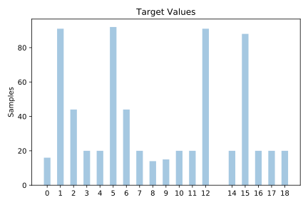
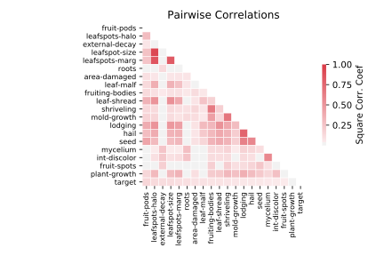

# soybean

[Metadata](metadata.yaml) | [Summary Statistics](summary_stats.csv)

## Summary

**task**: classification

**instances**: 675

**features**: 35

**number of classes**: 35

## Summary Plots

## Data Summary

|	variable	|	count	|	mean	|	std	|	min	|	25%	|	50%	|	75%	|	max|
| --- | --- | --- | --- | --- | --- | --- | --- | --- |
|	date	|	675	|	4	|	1	|	0	|	3	|	4	|	6	|	7
|	plant-stand	|	675	|	1	|	0	|	0	|	1	|	2	|	2	|	2
|	precip	|	675	|	1	|	0	|	0	|	1	|	1	|	2	|	3
|	temp	|	675	|	2	|	0	|	0	|	1	|	3	|	3	|	3
|	hail	|	675	|	1	|	0	|	0	|	1	|	2	|	2	|	2
|	crop-hist	|	675	|	2	|	1	|	0	|	2	|	3	|	3	|	4
|	area-damaged	|	675	|	2	|	1	|	0	|	1	|	2	|	4	|	4
|	severity	|	675	|	1	|	0	|	0	|	1	|	2	|	2	|	3
|	seed-tmt	|	675	|	1	|	0	|	0	|	1	|	2	|	2	|	3
|	germination	|	675	|	1	|	1	|	0	|	0	|	1	|	3	|	3
|	plant-growth	|	675	|	1	|	0	|	0	|	1	|	2	|	2	|	2
|	leaves	|	675	|	0	|	0	|	0	|	0	|	0	|	0	|	1
|	leafspots-halo	|	675	|	1	|	0	|	0	|	1	|	2	|	2	|	3
|	leafspots-marg	|	675	|	1	|	1	|	0	|	1	|	3	|	3	|	3
|	leafspot-size	|	675	|	1	|	0	|	0	|	1	|	2	|	2	|	3
|	leaf-shread	|	675	|	0	|	0	|	0	|	1	|	1	|	1	|	2
|	leaf-malf	|	675	|	0	|	0	|	0	|	1	|	1	|	1	|	2
|	leaf-mild	|	675	|	0	|	0	|	0	|	1	|	1	|	1	|	3
|	stem	|	675	|	1	|	0	|	0	|	1	|	1	|	2	|	2
|	lodging	|	675	|	1	|	0	|	0	|	2	|	2	|	2	|	2
|	stem-cankers	|	675	|	2	|	1	|	0	|	1	|	3	|	3	|	4
|	canker-lesion	|	675	|	2	|	0	|	0	|	2	|	3	|	3	|	4
|	fruiting-bodies	|	675	|	1	|	0	|	0	|	1	|	1	|	1	|	2
|	external-decay	|	675	|	1	|	0	|	0	|	1	|	1	|	1	|	3
|	mycelium	|	675	|	0	|	0	|	0	|	1	|	1	|	1	|	2
|	int-discolor	|	675	|	2	|	0	|	0	|	3	|	3	|	3	|	3
|	sclerotia	|	675	|	0	|	0	|	0	|	1	|	1	|	1	|	2
|	fruit-pods	|	675	|	2	|	1	|	0	|	1	|	4	|	4	|	4
|	fruit-spots	|	675	|	1	|	1	|	0	|	1	|	1	|	3	|	4
|	seed	|	675	|	1	|	0	|	0	|	1	|	2	|	2	|	2
|	mold-growth	|	675	|	0	|	0	|	0	|	1	|	1	|	1	|	2
|	seed-discolor	|	675	|	0	|	0	|	0	|	1	|	1	|	1	|	2
|	seed-size	|	675	|	1	|	0	|	0	|	2	|	2	|	2	|	2
|	shriveling	|	675	|	0	|	0	|	0	|	1	|	1	|	1	|	2
|	roots	|	675	|	2	|	0	|	0	|	2	|	2	|	2	|	3
|	target	|	675	|	8	|	5	|	0	|	3	|	7	|	12	|	18
