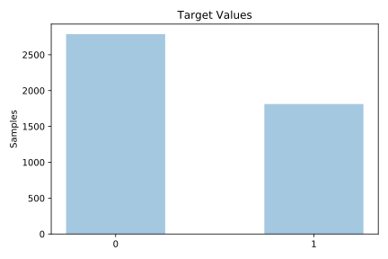
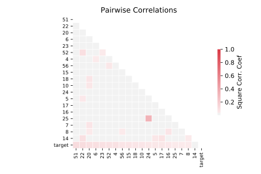

# spambase

[Metadata](metadata.yaml) | [Summary Statistics](summary_stats.csv)

## Summary

**task**: classification

**instances**: 4601

**features**: 57

**number of classes**: 57

## Summary Plots

## Data Summary

|	variable	|	count	|	mean	|	std	|	min	|	25%	|	50%	|	75%	|	max|
| --- | --- | --- | --- | --- | --- | --- | --- | --- |
|	0	|	4601	|	0	|	0	|	0	|	0	|	0	|	0	|	4
|	1	|	4601	|	0	|	1	|	0	|	0	|	0	|	0	|	14
|	2	|	4601	|	0	|	0	|	0	|	0	|	0	|	0	|	5
|	3	|	4601	|	0	|	1	|	0	|	0	|	0	|	0	|	42
|	4	|	4601	|	0	|	0	|	0	|	0	|	0	|	0	|	10
|	5	|	4601	|	0	|	0	|	0	|	0	|	0	|	0	|	5
|	6	|	4601	|	0	|	0	|	0	|	0	|	0	|	0	|	7
|	7	|	4601	|	0	|	0	|	0	|	0	|	0	|	0	|	11
|	8	|	4601	|	0	|	0	|	0	|	0	|	0	|	0	|	5
|	9	|	4601	|	0	|	0	|	0	|	0	|	0	|	0	|	18
|	10	|	4601	|	0	|	0	|	0	|	0	|	0	|	0	|	2
|	11	|	4601	|	0	|	0	|	0	|	0	|	0	|	0	|	9
|	12	|	4601	|	0	|	0	|	0	|	0	|	0	|	0	|	5
|	13	|	4601	|	0	|	0	|	0	|	0	|	0	|	0	|	10
|	14	|	4601	|	0	|	0	|	0	|	0	|	0	|	0	|	4
|	15	|	4601	|	0	|	0	|	0	|	0	|	0	|	0	|	20
|	16	|	4601	|	0	|	0	|	0	|	0	|	0	|	0	|	7
|	17	|	4601	|	0	|	0	|	0	|	0	|	0	|	0	|	9
|	18	|	4601	|	1	|	1	|	0	|	0	|	1	|	2	|	18
|	19	|	4601	|	0	|	0	|	0	|	0	|	0	|	0	|	18
|	20	|	4601	|	0	|	1	|	0	|	0	|	0	|	1	|	11
|	21	|	4601	|	0	|	1	|	0	|	0	|	0	|	0	|	17
|	22	|	4601	|	0	|	0	|	0	|	0	|	0	|	0	|	5
|	23	|	4601	|	0	|	0	|	0	|	0	|	0	|	0	|	12
|	24	|	4601	|	0	|	1	|	0	|	0	|	0	|	0	|	20
|	25	|	4601	|	0	|	0	|	0	|	0	|	0	|	0	|	16
|	26	|	4601	|	0	|	3	|	0	|	0	|	0	|	0	|	33
|	27	|	4601	|	0	|	0	|	0	|	0	|	0	|	0	|	9
|	28	|	4601	|	0	|	0	|	0	|	0	|	0	|	0	|	14
|	29	|	4601	|	0	|	0	|	0	|	0	|	0	|	0	|	5
|	30	|	4601	|	0	|	0	|	0	|	0	|	0	|	0	|	12
|	31	|	4601	|	0	|	0	|	0	|	0	|	0	|	0	|	4
|	32	|	4601	|	0	|	0	|	0	|	0	|	0	|	0	|	18
|	33	|	4601	|	0	|	0	|	0	|	0	|	0	|	0	|	4
|	34	|	4601	|	0	|	0	|	0	|	0	|	0	|	0	|	20
|	35	|	4601	|	0	|	0	|	0	|	0	|	0	|	0	|	7
|	36	|	4601	|	0	|	0	|	0	|	0	|	0	|	0	|	6
|	37	|	4601	|	0	|	0	|	0	|	0	|	0	|	0	|	8
|	38	|	4601	|	0	|	0	|	0	|	0	|	0	|	0	|	11
|	39	|	4601	|	0	|	0	|	0	|	0	|	0	|	0	|	4
|	40	|	4601	|	0	|	0	|	0	|	0	|	0	|	0	|	7
|	41	|	4601	|	0	|	0	|	0	|	0	|	0	|	0	|	14
|	42	|	4601	|	0	|	0	|	0	|	0	|	0	|	0	|	3
|	43	|	4601	|	0	|	0	|	0	|	0	|	0	|	0	|	20
|	44	|	4601	|	0	|	1	|	0	|	0	|	0	|	0	|	21
|	45	|	4601	|	0	|	0	|	0	|	0	|	0	|	0	|	22
|	46	|	4601	|	0	|	0	|	0	|	0	|	0	|	0	|	2
|	47	|	4601	|	0	|	0	|	0	|	0	|	0	|	0	|	10
|	48	|	4601	|	0	|	0	|	0	|	0	|	0	|	0	|	4
|	49	|	4601	|	0	|	0	|	0	|	0	|	0	|	0	|	9
|	50	|	4601	|	0	|	0	|	0	|	0	|	0	|	0	|	4
|	51	|	4601	|	0	|	0	|	0	|	0	|	0	|	0	|	32
|	52	|	4601	|	0	|	0	|	0	|	0	|	0	|	0	|	6
|	53	|	4601	|	0	|	0	|	0	|	0	|	0	|	0	|	19
|	54	|	4601	|	5	|	31	|	1	|	1	|	2	|	3	|	1102
|	55	|	4601	|	52	|	194	|	1	|	6	|	15	|	43	|	9989
|	56	|	4601	|	283	|	606	|	1	|	35	|	95	|	266	|	15841
|	target	|	4601	|	0	|	0	|	0	|	0	|	0	|	1	|	1
