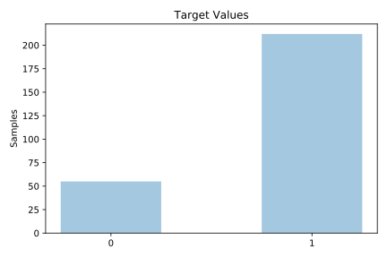
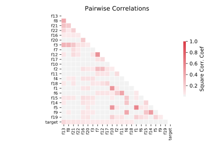

# spect

[Metadata](metadata.yaml) | [Summary Statistics](summary_stats.csv)

## Summary

**task**: classification

**instances**: 267

**features**: 22

**number of classes**: 22

## Summary Plots

## Data Summary

|	variable	|	count	|	mean	|	std	|	min	|	25%	|	50%	|	75%	|	max|
| --- | --- | --- | --- | --- | --- | --- | --- | --- |
|	F1	|	267	|	0	|	0	|	0	|	0	|	0	|	1	|	1
|	F2	|	267	|	0	|	0	|	0	|	0	|	0	|	0	|	1
|	F3	|	267	|	0	|	0	|	0	|	0	|	0	|	1	|	1
|	F4	|	267	|	0	|	0	|	0	|	0	|	0	|	1	|	1
|	F5	|	267	|	0	|	0	|	0	|	0	|	0	|	1	|	1
|	F6	|	267	|	0	|	0	|	0	|	0	|	0	|	0	|	1
|	F7	|	267	|	0	|	0	|	0	|	0	|	0	|	1	|	1
|	F8	|	267	|	0	|	0	|	0	|	0	|	0	|	1	|	1
|	F9	|	267	|	0	|	0	|	0	|	0	|	0	|	1	|	1
|	F10	|	267	|	0	|	0	|	0	|	0	|	0	|	1	|	1
|	F11	|	267	|	0	|	0	|	0	|	0	|	0	|	0	|	1
|	F12	|	267	|	0	|	0	|	0	|	0	|	0	|	1	|	1
|	F13	|	267	|	0	|	0	|	0	|	0	|	0	|	1	|	1
|	F14	|	267	|	0	|	0	|	0	|	0	|	0	|	1	|	1
|	F15	|	267	|	0	|	0	|	0	|	0	|	0	|	0	|	1
|	F16	|	267	|	0	|	0	|	0	|	0	|	0	|	1	|	1
|	F17	|	267	|	0	|	0	|	0	|	0	|	0	|	0	|	1
|	F18	|	267	|	0	|	0	|	0	|	0	|	0	|	0	|	1
|	F19	|	267	|	0	|	0	|	0	|	0	|	0	|	0	|	1
|	F20	|	267	|	0	|	0	|	0	|	0	|	0	|	1	|	1
|	F21	|	267	|	0	|	0	|	0	|	0	|	0	|	1	|	1
|	F22	|	267	|	0	|	0	|	0	|	0	|	0	|	1	|	1
|	target	|	267	|	0	|	0	|	0	|	1	|	1	|	1	|	1
