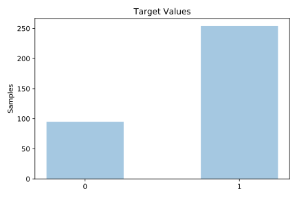
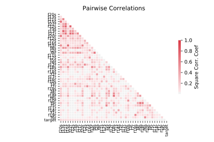

# spectf

[Metadata](metadata.yaml) | [Summary Statistics](summary_stats.csv)

## Summary

**task**: classification

**instances**: 349

**features**: 44

**number of classes**: 44

## Summary Plots

## Data Summary

|	variable	|	count	|	mean	|	std	|	min	|	25%	|	50%	|	75%	|	max|
| --- | --- | --- | --- | --- | --- | --- | --- | --- |
|	F1R	|	349	|	66	|	7	|	23	|	62	|	68	|	72	|	83
|	F1S	|	349	|	65	|	8	|	21	|	61	|	66	|	72	|	81
|	F2R	|	349	|	68	|	6	|	38	|	66	|	70	|	73	|	82
|	F2S	|	349	|	69	|	7	|	34	|	66	|	71	|	75	|	84
|	F3R	|	349	|	65	|	8	|	21	|	62	|	66	|	70	|	82
|	F3S	|	349	|	64	|	9	|	25	|	61	|	67	|	70	|	89
|	F4R	|	349	|	70	|	7	|	21	|	68	|	72	|	75	|	85
|	F4S	|	349	|	69	|	8	|	20	|	67	|	72	|	75	|	83
|	F5R	|	349	|	63	|	8	|	12	|	61	|	65	|	68	|	77
|	F5S	|	349	|	62	|	9	|	22	|	58	|	64	|	68	|	78
|	F6R	|	349	|	70	|	7	|	11	|	67	|	72	|	75	|	81
|	F6S	|	349	|	70	|	8	|	12	|	68	|	72	|	76	|	82
|	F7R	|	349	|	67	|	7	|	32	|	65	|	69	|	72	|	79
|	F7S	|	349	|	67	|	7	|	28	|	65	|	70	|	73	|	80
|	F8R	|	349	|	62	|	9	|	23	|	59	|	64	|	68	|	77
|	F8S	|	349	|	60	|	11	|	8	|	57	|	62	|	68	|	77
|	F9R	|	349	|	67	|	8	|	3	|	65	|	69	|	73	|	80
|	F9S	|	349	|	66	|	9	|	11	|	64	|	68	|	73	|	83
|	F10R	|	349	|	66	|	7	|	35	|	62	|	67	|	72	|	86
|	F10S	|	349	|	64	|	8	|	17	|	61	|	66	|	71	|	81
|	F11R	|	349	|	74	|	6	|	36	|	72	|	75	|	78	|	86
|	F11S	|	349	|	72	|	7	|	40	|	69	|	74	|	78	|	86
|	F12R	|	349	|	67	|	8	|	27	|	64	|	69	|	73	|	84
|	F12S	|	349	|	67	|	8	|	32	|	63	|	69	|	73	|	85
|	F13R	|	349	|	58	|	12	|	12	|	54	|	62	|	67	|	79
|	F13S	|	349	|	56	|	13	|	6	|	49	|	60	|	66	|	80
|	F14R	|	349	|	63	|	9	|	8	|	60	|	64	|	69	|	80
|	F14S	|	349	|	61	|	10	|	17	|	57	|	63	|	68	|	86
|	F15R	|	349	|	62	|	10	|	13	|	60	|	66	|	69	|	79
|	F15S	|	349	|	61	|	12	|	7	|	59	|	65	|	69	|	78
|	F16R	|	349	|	71	|	5	|	39	|	70	|	72	|	75	|	80
|	F16S	|	349	|	71	|	7	|	9	|	70	|	74	|	76	|	84
|	F17R	|	349	|	61	|	6	|	28	|	59	|	62	|	65	|	77
|	F17S	|	349	|	61	|	7	|	16	|	59	|	62	|	66	|	80
|	F18R	|	349	|	64	|	7	|	18	|	62	|	66	|	68	|	76
|	F18S	|	349	|	63	|	10	|	13	|	61	|	65	|	69	|	77
|	F19R	|	349	|	65	|	7	|	33	|	62	|	66	|	71	|	80
|	F19S	|	349	|	64	|	9	|	18	|	60	|	66	|	71	|	79
|	F20R	|	349	|	66	|	11	|	11	|	64	|	70	|	73	|	83
|	F20S	|	349	|	65	|	11	|	6	|	61	|	68	|	73	|	81
|	F21R	|	349	|	63	|	13	|	5	|	60	|	67	|	73	|	82
|	F21S	|	349	|	61	|	14	|	8	|	58	|	67	|	71	|	83
|	F22R	|	349	|	53	|	12	|	11	|	50	|	56	|	62	|	82
|	F22S	|	349	|	51	|	14	|	4	|	46	|	56	|	61	|	73
|	target	|	349	|	0	|	0	|	0	|	0	|	1	|	1	|	1
