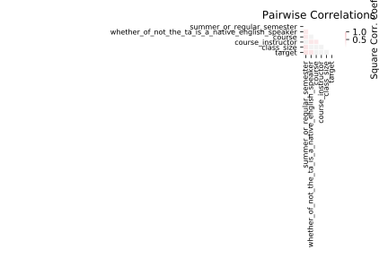

# tae

[Metadata](metadata.yaml) | [Summary Statistics](summary_stats.csv)

## Summary

**task**: classification

**instances**: 151

**features**: 5

**number of classes**: 5

## Summary Plots

## Data Summary

|	variable	|	count	|	mean	|	std	|	min	|	25%	|	50%	|	75%	|	max|
| --- | --- | --- | --- | --- | --- | --- | --- | --- |
|	Whether_of_not_the_TA_is_a_native_English_speaker	|	151	|	1	|	0	|	1	|	2	|	2	|	2	|	2
|	Course_instructor	|	151	|	13	|	6	|	1	|	8	|	13	|	20	|	25
|	Course	|	151	|	8	|	7	|	1	|	3	|	4	|	15	|	26
|	Summer_or_regular_semester	|	151	|	1	|	0	|	1	|	2	|	2	|	2	|	2
|	Class_size	|	151	|	27	|	12	|	3	|	19	|	27	|	37	|	66
|	target	|	151	|	2	|	0	|	1	|	1	|	2	|	3	|	3
