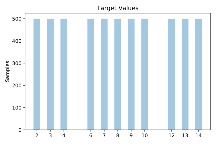
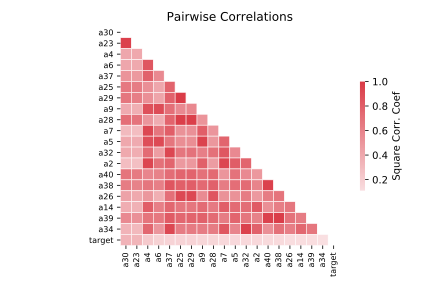

# texture

[Metadata](metadata.yaml) | [Summary Statistics](summary_stats.csv)

## Summary

**task**: classification

**instances**: 5500

**features**: 40

**number of classes**: 40

## Summary Plots

## Data Summary

|	variable	|	count	|	mean	|	std	|	min	|	25%	|	50%	|	75%	|	max|
| --- | --- | --- | --- | --- | --- | --- | --- | --- |
|	A1	|	5500	|	-1	|	0	|	-1	|	-1	|	-1	|	-1	|	0
|	A2	|	5500	|	0	|	0	|	-1	|	0	|	0	|	0	|	0
|	A3	|	5500	|	0	|	0	|	-1	|	0	|	0	|	0	|	0
|	A4	|	5500	|	0	|	0	|	-1	|	0	|	0	|	0	|	0
|	A5	|	5500	|	0	|	0	|	-1	|	0	|	0	|	0	|	0
|	A6	|	5500	|	0	|	0	|	-1	|	0	|	0	|	0	|	0
|	A7	|	5500	|	0	|	0	|	-1	|	0	|	0	|	0	|	0
|	A8	|	5500	|	0	|	0	|	-1	|	0	|	0	|	0	|	0
|	A9	|	5500	|	0	|	0	|	-1	|	0	|	0	|	0	|	0
|	A10	|	5500	|	0	|	0	|	-1	|	0	|	0	|	0	|	0
|	A11	|	5500	|	-1	|	0	|	-1	|	-1	|	-1	|	-1	|	0
|	A12	|	5500	|	0	|	0	|	-1	|	0	|	0	|	0	|	0
|	A13	|	5500	|	0	|	0	|	-1	|	0	|	0	|	0	|	0
|	A14	|	5500	|	0	|	0	|	-1	|	0	|	0	|	0	|	0
|	A15	|	5500	|	0	|	0	|	0	|	0	|	0	|	0	|	0
|	A16	|	5500	|	0	|	0	|	0	|	0	|	0	|	0	|	0
|	A17	|	5500	|	0	|	0	|	-1	|	0	|	0	|	0	|	0
|	A18	|	5500	|	0	|	0	|	-1	|	0	|	0	|	0	|	0
|	A19	|	5500	|	0	|	0	|	-1	|	0	|	0	|	0	|	0
|	A20	|	5500	|	0	|	0	|	-1	|	0	|	0	|	0	|	0
|	A21	|	5500	|	-1	|	0	|	-1	|	-1	|	-1	|	-1	|	0
|	A22	|	5500	|	0	|	0	|	-1	|	0	|	0	|	0	|	0
|	A23	|	5500	|	0	|	0	|	-1	|	-1	|	0	|	0	|	0
|	A24	|	5500	|	0	|	0	|	-1	|	0	|	0	|	0	|	0
|	A25	|	5500	|	0	|	0	|	-1	|	0	|	0	|	0	|	0
|	A26	|	5500	|	0	|	0	|	-1	|	0	|	0	|	0	|	0
|	A27	|	5500	|	0	|	0	|	-1	|	0	|	0	|	0	|	0
|	A28	|	5500	|	0	|	0	|	-1	|	0	|	0	|	0	|	0
|	A29	|	5500	|	0	|	0	|	-1	|	0	|	0	|	0	|	0
|	A30	|	5500	|	0	|	0	|	-1	|	-1	|	0	|	0	|	0
|	A31	|	5500	|	-1	|	0	|	-1	|	-1	|	-1	|	-1	|	0
|	A32	|	5500	|	0	|	0	|	-1	|	0	|	0	|	0	|	0
|	A33	|	5500	|	0	|	0	|	-1	|	0	|	0	|	0	|	0
|	A34	|	5500	|	0	|	0	|	-1	|	0	|	0	|	0	|	0
|	A35	|	5500	|	0	|	0	|	-1	|	0	|	0	|	0	|	0
|	A36	|	5500	|	0	|	0	|	-1	|	0	|	0	|	0	|	0
|	A37	|	5500	|	0	|	0	|	-1	|	0	|	0	|	0	|	0
|	A38	|	5500	|	0	|	0	|	-1	|	0	|	0	|	0	|	0
|	A39	|	5500	|	0	|	0	|	-1	|	0	|	0	|	0	|	0
|	A40	|	5500	|	0	|	0	|	-1	|	0	|	0	|	0	|	0
|	target	|	5500	|	8	|	3	|	2	|	4	|	8	|	12	|	14
