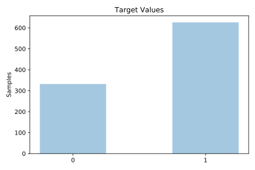

# tic_tac_toe

[Metadata](metadata.yaml) | [Summary Statistics](summary_stats.csv)

## Summary

**task**: classification

**instances**: 958

**features**: 9

**number of classes**: 9

## Summary Plots

## Data Summary

|	variable	|	count	|	mean	|	std	|	min	|	25%	|	50%	|	75%	|	max|
| --- | --- | --- | --- | --- | --- | --- | --- | --- |
|	t1	|	958	|	1	|	0	|	0	|	1	|	1	|	2	|	2
|	t2	|	958	|	1	|	0	|	0	|	0	|	1	|	2	|	2
|	t3	|	958	|	1	|	0	|	0	|	1	|	1	|	2	|	2
|	t4	|	958	|	1	|	0	|	0	|	0	|	1	|	2	|	2
|	t5	|	958	|	1	|	0	|	0	|	1	|	1	|	2	|	2
|	t6	|	958	|	1	|	0	|	0	|	0	|	1	|	2	|	2
|	t7	|	958	|	1	|	0	|	0	|	1	|	1	|	2	|	2
|	t8	|	958	|	1	|	0	|	0	|	0	|	1	|	2	|	2
|	t9	|	958	|	1	|	0	|	0	|	1	|	1	|	2	|	2
|	target	|	958	|	0	|	0	|	0	|	0	|	1	|	1	|	1
