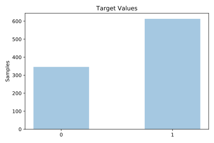
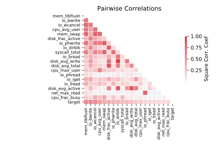

# tokyo1

[Metadata](metadata.yaml) | [Summary Statistics](summary_stats.csv)

## Summary

**task**: classification

**instances**: 959

**features**: 44

**number of classes**: 44

## Summary Plots

## Data Summary

|	variable	|	count	|	mean	|	std	|	min	|	25%	|	50%	|	75%	|	max|
| --- | --- | --- | --- | --- | --- | --- | --- | --- |
|	cpu_avg_user	|	959	|	0	|	0	|	0	|	0	|	0	|	0	|	0
|	cpu_avg_sys	|	959	|	64	|	753	|	0	|	0	|	0	|	0	|	8859
|	cpu_avg_busy	|	959	|	64	|	753	|	0	|	0	|	0	|	0	|	8859
|	cpu_avg_wait	|	959	|	0	|	0	|	0	|	0	|	0	|	0	|	0
|	cpu_avg_idle	|	959	|	74	|	805	|	0	|	0	|	0	|	0	|	8859
|	cpu_avg_waste	|	959	|	74	|	805	|	0	|	0	|	0	|	0	|	8859
|	cpu_max_user	|	959	|	0	|	0	|	0	|	0	|	0	|	0	|	0
|	cpu_max_sys	|	959	|	517	|	6031	|	0	|	0	|	0	|	0	|	70870
|	cpu_max_busy	|	959	|	517	|	6031	|	0	|	0	|	0	|	0	|	70870
|	cpu_max_wait	|	959	|	0	|	0	|	0	|	0	|	0	|	0	|	0
|	cpu_max_idle	|	959	|	591	|	6444	|	0	|	0	|	0	|	0	|	70820
|	cpu_max_waste	|	959	|	591	|	6444	|	0	|	0	|	0	|	0	|	70820
|	cpu_frac_busy	|	959	|	0	|	0	|	0	|	0	|	0	|	0	|	1
|	io_iget	|	959	|	496661	|	714634	|	3004	|	124850	|	206600	|	564100	|	4151000
|	io_bread	|	959	|	491614	|	324088	|	5564	|	345950	|	415900	|	671150	|	1449000
|	io_bwrite	|	959	|	1856418	|	1780407	|	18790	|	536250	|	1178000	|	2954000	|	9368000
|	io_lread	|	959	|	2584689	|	3352056	|	17890	|	895950	|	1198000	|	2980000	|	30590000
|	io_lwrite	|	959	|	0	|	17	|	0	|	0	|	0	|	0	|	546
|	io_phread	|	959	|	73720	|	206827	|	0	|	0	|	0	|	23490	|	1112000
|	io_phwrite	|	959	|	37592	|	70384	|	750	|	750	|	819	|	20870	|	321700
|	io_wcancel	|	959	|	136	|	185	|	2	|	14	|	39	|	210	|	738
|	io_namei	|	959	|	0	|	0	|	0	|	0	|	0	|	0	|	0
|	io_dirblk	|	959	|	0	|	0	|	0	|	0	|	0	|	0	|	0
|	disk_avg_active	|	959	|	0	|	0	|	0	|	0	|	0	|	0	|	0
|	disk_max_active	|	959	|	0	|	0	|	0	|	0	|	0	|	0	|	0
|	disk_frac_active	|	959	|	2	|	2	|	0	|	1	|	2	|	4	|	9
|	disk_avg_read	|	959	|	3	|	2	|	0	|	2	|	3	|	3	|	9
|	disk_avg_write	|	959	|	6	|	3	|	0	|	4	|	6	|	8	|	15
|	disk_avg_total	|	959	|	15	|	11	|	0	|	9	|	12	|	22	|	60
|	disk_max_read	|	959	|	18	|	11	|	0	|	12	|	17	|	20	|	60
|	disk_max_write	|	959	|	32	|	17	|	0	|	26	|	32	|	43	|	73
|	disk_max_total	|	959	|	0	|	0	|	0	|	0	|	0	|	0	|	0
|	disk_frac_busy	|	959	|	34	|	76	|	7	|	15	|	19	|	29	|	928
|	net_avg_read	|	959	|	6	|	6	|	1	|	3	|	4	|	7	|	35
|	net_avg_write	|	959	|	41	|	77	|	9	|	19	|	24	|	38	|	931
|	net_avg_total	|	959	|	195	|	401	|	20	|	90	|	107	|	181	|	5011
|	net_max_read	|	959	|	45	|	52	|	7	|	16	|	29	|	40	|	395
|	net_max_write	|	959	|	214	|	403	|	22	|	94	|	114	|	194	|	5012
|	net_max_total	|	959	|	0	|	0	|	0	|	0	|	0	|	0	|	0
|	net_frac_busy	|	959	|	0	|	0	|	0	|	0	|	0	|	0	|	0
|	mem_swap	|	959	|	121	|	207	|	9	|	9	|	11	|	52	|	768
|	mem_fault	|	959	|	0	|	4	|	0	|	0	|	0	|	0	|	97
|	mem_tlbflush	|	959	|	1022	|	866	|	204	|	367	|	539	|	1723	|	3201
|	syscall_total	|	959	|	1	|	3	|	0	|	0	|	0	|	1	|	35
|	target	|	959	|	0	|	0	|	0	|	0	|	1	|	1	|	1
