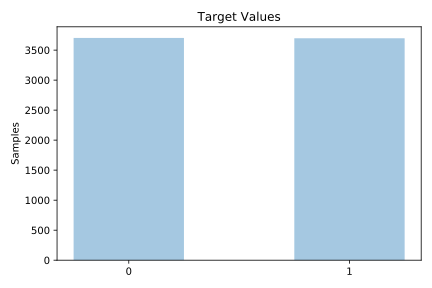
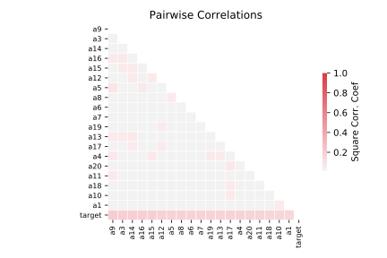

# twonorm

[Metadata](metadata.yaml) | [Summary Statistics](summary_stats.csv)

## Summary

**task**: classification

**instances**: 7400

**features**: 20

**number of classes**: 20

## Summary Plots

## Data Summary

|	variable	|	count	|	mean	|	std	|	min	|	25%	|	50%	|	75%	|	max|
| --- | --- | --- | --- | --- | --- | --- | --- | --- |
|	A1	|	7400	|	0	|	1	|	-4	|	0	|	0	|	0	|	3
|	A2	|	7400	|	0	|	1	|	-3	|	0	|	0	|	0	|	4
|	A3	|	7400	|	0	|	1	|	-4	|	0	|	0	|	0	|	4
|	A4	|	7400	|	0	|	1	|	-3	|	0	|	0	|	0	|	4
|	A5	|	7400	|	0	|	1	|	-3	|	0	|	0	|	0	|	5
|	A6	|	7400	|	0	|	1	|	-4	|	0	|	0	|	0	|	3
|	A7	|	7400	|	0	|	1	|	-3	|	0	|	0	|	0	|	4
|	A8	|	7400	|	0	|	1	|	-4	|	0	|	0	|	0	|	3
|	A9	|	7400	|	0	|	1	|	-3	|	0	|	0	|	0	|	4
|	A10	|	7400	|	0	|	1	|	-4	|	0	|	0	|	0	|	4
|	A11	|	7400	|	0	|	1	|	-3	|	0	|	0	|	0	|	4
|	A12	|	7400	|	0	|	1	|	-3	|	0	|	0	|	0	|	4
|	A13	|	7400	|	0	|	1	|	-3	|	0	|	0	|	0	|	3
|	A14	|	7400	|	0	|	1	|	-3	|	0	|	0	|	0	|	4
|	A15	|	7400	|	0	|	1	|	-3	|	0	|	0	|	0	|	3
|	A16	|	7400	|	0	|	1	|	-3	|	0	|	0	|	0	|	4
|	A17	|	7400	|	0	|	1	|	-3	|	0	|	0	|	0	|	3
|	A18	|	7400	|	0	|	1	|	-4	|	0	|	0	|	0	|	4
|	A19	|	7400	|	0	|	1	|	-4	|	0	|	0	|	0	|	4
|	A20	|	7400	|	0	|	1	|	-3	|	0	|	0	|	0	|	4
|	target	|	7400	|	0	|	0	|	0	|	0	|	0	|	1	|	1
