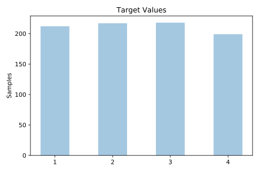
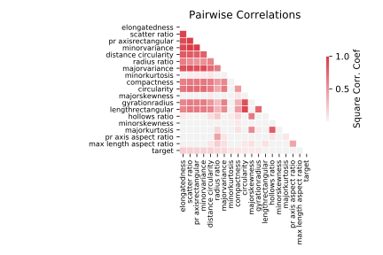

# vehicle

[Metadata](metadata.yaml) | [Summary Statistics](summary_stats.csv)

## Summary

**task**: classification

**instances**: 846

**features**: 18

**number of classes**: 18

## Summary Plots

## Data Summary

|	variable	|	count	|	mean	|	std	|	min	|	25%	|	50%	|	75%	|	max|
| --- | --- | --- | --- | --- | --- | --- | --- | --- |
|	COMPACTNESS	|	846	|	93	|	8	|	73	|	87	|	93	|	100	|	119
|	CIRCULARITY	|	846	|	44	|	6	|	33	|	40	|	44	|	49	|	59
|	DISTANCE CIRCULARITY	|	846	|	82	|	15	|	40	|	70	|	80	|	98	|	112
|	RADIUS RATIO	|	846	|	168	|	33	|	104	|	141	|	167	|	195	|	333
|	PR AXIS ASPECT RATIO	|	846	|	61	|	7	|	47	|	57	|	61	|	65	|	138
|	MAX LENGTH ASPECT RATIO	|	846	|	8	|	4	|	2	|	7	|	8	|	10	|	55
|	SCATTER RATIO	|	846	|	168	|	33	|	112	|	146	|	157	|	198	|	265
|	ELONGATEDNESS	|	846	|	40	|	7	|	26	|	33	|	43	|	46	|	61
|	PR AXISRECTANGULAR	|	846	|	20	|	2	|	17	|	19	|	20	|	23	|	29
|	LENGTHRECTANGULAR	|	846	|	147	|	14	|	118	|	137	|	146	|	159	|	188
|	MAJORVARIANCE	|	846	|	188	|	31	|	130	|	167	|	178	|	217	|	320
|	MINORVARIANCE	|	846	|	439	|	176	|	184	|	318	|	364	|	587	|	1018
|	GYRATIONRADIUS	|	846	|	174	|	32	|	109	|	149	|	173	|	198	|	268
|	MAJORSKEWNESS	|	846	|	72	|	7	|	59	|	67	|	71	|	75	|	135
|	MINORSKEWNESS	|	846	|	6	|	4	|	0	|	2	|	6	|	9	|	22
|	MINORKURTOSIS	|	846	|	12	|	8	|	0	|	5	|	11	|	19	|	41
|	MAJORKURTOSIS	|	846	|	188	|	6	|	176	|	184	|	188	|	193	|	206
|	HOLLOWS RATIO	|	846	|	195	|	7	|	181	|	190	|	197	|	201	|	211
|	target	|	846	|	2	|	1	|	1	|	1	|	2	|	3	|	4
