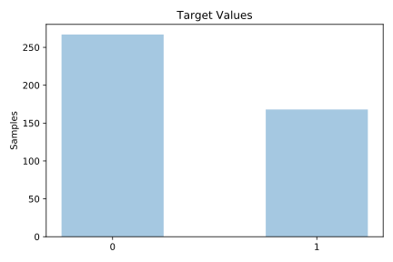
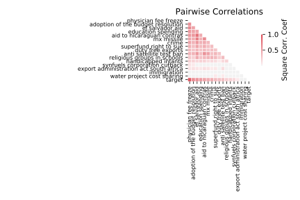

# vote

[Metadata](metadata.yaml) | [Summary Statistics](summary_stats.csv)

## Summary

**task**: classification

**instances**: 435

**features**: 16

**number of classes**: 16

## Summary Plots

## Data Summary

|	variable	|	count	|	mean	|	std	|	min	|	25%	|	50%	|	75%	|	max|
| --- | --- | --- | --- | --- | --- | --- | --- | --- |
|	handicapped infants	|	435	|	0	|	0	|	0	|	0	|	0	|	2	|	2
|	water project cost sharing	|	435	|	1	|	0	|	0	|	0	|	1	|	2	|	2
|	adoption of the budget resolution	|	435	|	1	|	0	|	0	|	0	|	2	|	2	|	2
|	physician fee freeze	|	435	|	0	|	0	|	0	|	0	|	0	|	2	|	2
|	el salvador aid	|	435	|	1	|	0	|	0	|	0	|	1	|	2	|	2
|	religious groups in schools	|	435	|	1	|	0	|	0	|	0	|	2	|	2	|	2
|	anti satellite test ban	|	435	|	1	|	0	|	0	|	0	|	2	|	2	|	2
|	aid to nicaraguan contras	|	435	|	1	|	0	|	0	|	0	|	2	|	2	|	2
|	mx missile	|	435	|	1	|	0	|	0	|	0	|	1	|	2	|	2
|	immigration	|	435	|	1	|	0	|	0	|	0	|	1	|	2	|	2
|	synfuels corporation cutback	|	435	|	0	|	0	|	0	|	0	|	0	|	2	|	2
|	education spending	|	435	|	0	|	0	|	0	|	0	|	0	|	2	|	2
|	superfund right to sue	|	435	|	1	|	0	|	0	|	0	|	1	|	2	|	2
|	crime	|	435	|	1	|	0	|	0	|	0	|	2	|	2	|	2
|	duty free exports	|	435	|	0	|	0	|	0	|	0	|	0	|	2	|	2
|	export administration act south africa	|	435	|	1	|	0	|	0	|	1	|	2	|	2	|	2
|	target	|	435	|	0	|	0	|	0	|	0	|	0	|	1	|	1
