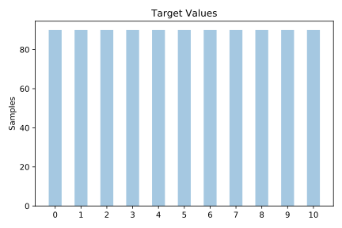
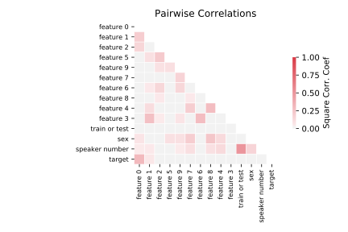

# vowel

[Metadata](metadata.yaml) | [Summary Statistics](summary_stats.csv)

## Summary

**task**: classification

**instances**: 990

**features**: 13

**number of classes**: 13

## Summary Plots

## Data Summary

|	variable	|	count	|	mean	|	std	|	min	|	25%	|	50%	|	75%	|	max|
| --- | --- | --- | --- | --- | --- | --- | --- | --- |
|	Train or Test	|	990	|	0	|	0	|	0	|	0	|	1	|	1	|	1
|	Speaker Number	|	990	|	7	|	4	|	0	|	3	|	7	|	11	|	14
|	Sex	|	990	|	0	|	0	|	0	|	0	|	1	|	1	|	1
|	Feature 0	|	990	|	-3	|	0	|	-5	|	-3	|	-3	|	-2	|	0
|	Feature 1	|	990	|	1	|	1	|	-1	|	1	|	1	|	2	|	5
|	Feature 2	|	990	|	0	|	0	|	-2	|	0	|	0	|	0	|	1
|	Feature 3	|	990	|	0	|	0	|	-1	|	0	|	0	|	1	|	2
|	Feature 4	|	990	|	0	|	0	|	-2	|	0	|	0	|	0	|	1
|	Feature 5	|	990	|	0	|	0	|	0	|	0	|	0	|	1	|	2
|	Feature 6	|	990	|	0	|	0	|	-1	|	0	|	0	|	0	|	1
|	Feature 7	|	990	|	0	|	0	|	-1	|	0	|	0	|	0	|	2
|	Feature 8	|	990	|	0	|	0	|	-1	|	0	|	0	|	0	|	1
|	Feature 9	|	990	|	0	|	0	|	-1	|	0	|	0	|	0	|	1
|	target	|	990	|	5	|	3	|	0	|	2	|	5	|	8	|	10
