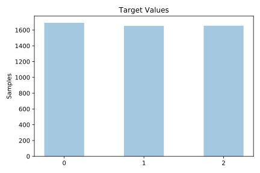
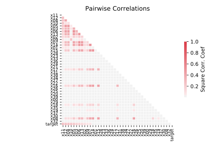

# waveform_40

[Metadata](metadata.yaml) | [Summary Statistics](summary_stats.csv)

## Summary

**task**: classification

**instances**: 5000

**features**: 40

**number of classes**: 40

## Summary Plots

## Data Summary

|	variable	|	count	|	mean	|	std	|	min	|	25%	|	50%	|	75%	|	max|
| --- | --- | --- | --- | --- | --- | --- | --- | --- |
|	X00	|	5000	|	0	|	1	|	-3	|	0	|	0	|	0	|	3
|	X01	|	5000	|	0	|	1	|	-3	|	0	|	0	|	1	|	4
|	X02	|	5000	|	0	|	1	|	-3	|	0	|	0	|	1	|	4
|	X03	|	5000	|	1	|	1	|	-3	|	0	|	0	|	2	|	5
|	X04	|	5000	|	1	|	1	|	-3	|	0	|	1	|	2	|	6
|	X05	|	5000	|	2	|	1	|	-3	|	0	|	1	|	3	|	7
|	X06	|	5000	|	2	|	2	|	-2	|	1	|	2	|	4	|	8
|	X07	|	5000	|	2	|	1	|	-2	|	1	|	2	|	3	|	7
|	X08	|	5000	|	2	|	1	|	-2	|	1	|	2	|	3	|	7
|	X09	|	5000	|	2	|	1	|	-1	|	1	|	3	|	4	|	7
|	X10	|	5000	|	3	|	1	|	-1	|	2	|	3	|	4	|	8
|	X11	|	5000	|	2	|	1	|	-1	|	1	|	3	|	4	|	7
|	X12	|	5000	|	2	|	1	|	-2	|	1	|	2	|	3	|	6
|	X13	|	5000	|	2	|	1	|	-2	|	1	|	2	|	3	|	8
|	X14	|	5000	|	2	|	2	|	-2	|	1	|	2	|	4	|	8
|	X15	|	5000	|	1	|	1	|	-2	|	0	|	1	|	3	|	7
|	X16	|	5000	|	1	|	1	|	-3	|	0	|	1	|	2	|	6
|	X17	|	5000	|	0	|	1	|	-3	|	0	|	0	|	1	|	6
|	X18	|	5000	|	0	|	1	|	-3	|	0	|	0	|	1	|	4
|	X19	|	5000	|	0	|	1	|	-3	|	0	|	0	|	1	|	4
|	X20	|	5000	|	0	|	1	|	-3	|	0	|	0	|	0	|	3
|	X21	|	5000	|	0	|	1	|	-3	|	0	|	0	|	0	|	3
|	X22	|	5000	|	0	|	0	|	-3	|	0	|	0	|	0	|	3
|	X23	|	5000	|	0	|	1	|	-3	|	0	|	0	|	0	|	3
|	X24	|	5000	|	0	|	1	|	-3	|	0	|	0	|	0	|	3
|	X25	|	5000	|	0	|	0	|	-3	|	0	|	0	|	0	|	3
|	X26	|	5000	|	0	|	0	|	-3	|	0	|	0	|	0	|	3
|	X27	|	5000	|	0	|	1	|	-3	|	0	|	0	|	0	|	3
|	X28	|	5000	|	0	|	0	|	-3	|	0	|	0	|	0	|	3
|	X29	|	5000	|	0	|	0	|	-3	|	0	|	0	|	0	|	3
|	X30	|	5000	|	0	|	0	|	-3	|	0	|	0	|	0	|	3
|	X31	|	5000	|	0	|	0	|	-3	|	0	|	0	|	0	|	3
|	X32	|	5000	|	0	|	1	|	-3	|	0	|	0	|	0	|	3
|	X33	|	5000	|	0	|	1	|	-3	|	0	|	0	|	0	|	4
|	X34	|	5000	|	0	|	1	|	-3	|	0	|	0	|	0	|	3
|	X35	|	5000	|	0	|	0	|	-3	|	0	|	0	|	0	|	3
|	X36	|	5000	|	0	|	0	|	-3	|	0	|	0	|	0	|	3
|	X37	|	5000	|	0	|	0	|	-3	|	0	|	0	|	0	|	3
|	X38	|	5000	|	0	|	1	|	-3	|	0	|	0	|	0	|	3
|	X39	|	5000	|	0	|	1	|	-3	|	0	|	0	|	0	|	3
|	target	|	5000	|	0	|	0	|	0	|	0	|	1	|	2	|	2
