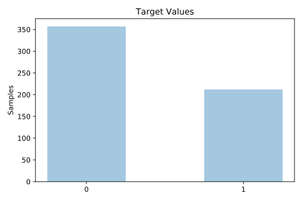
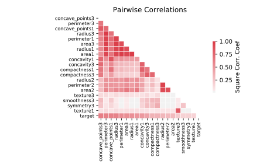

# wdbc

[Metadata](metadata.yaml) | [Summary Statistics](summary_stats.csv)

## Summary

**task**: classification

**instances**: 569

**features**: 30

**number of classes**: 30

## Summary Plots

## Data Summary

|	variable	|	count	|	mean	|	std	|	min	|	25%	|	50%	|	75%	|	max|
| --- | --- | --- | --- | --- | --- | --- | --- | --- |
|	Radius1	|	569	|	14	|	3	|	6	|	11	|	13	|	15	|	28
|	Texture1	|	569	|	19	|	4	|	9	|	16	|	18	|	21	|	39
|	Perimeter1	|	569	|	91	|	24	|	43	|	75	|	86	|	104	|	188
|	Area1	|	569	|	654	|	351	|	143	|	420	|	551	|	782	|	2501
|	Smoothness1	|	569	|	0	|	0	|	0	|	0	|	0	|	0	|	0
|	Compactness1	|	569	|	0	|	0	|	0	|	0	|	0	|	0	|	0
|	Concavity1	|	569	|	0	|	0	|	0	|	0	|	0	|	0	|	0
|	Concave_points1	|	569	|	0	|	0	|	0	|	0	|	0	|	0	|	0
|	Symmetry1	|	569	|	0	|	0	|	0	|	0	|	0	|	0	|	0
|	Fractal_dimension1	|	569	|	0	|	0	|	0	|	0	|	0	|	0	|	0
|	Radius2	|	569	|	0	|	0	|	0	|	0	|	0	|	0	|	2
|	Texture2	|	569	|	1	|	0	|	0	|	0	|	1	|	1	|	4
|	Perimeter2	|	569	|	2	|	2	|	0	|	1	|	2	|	3	|	21
|	Area2	|	569	|	40	|	45	|	6	|	17	|	24	|	45	|	542
|	Smoothness2	|	569	|	0	|	0	|	0	|	0	|	0	|	0	|	0
|	Compactness2	|	569	|	0	|	0	|	0	|	0	|	0	|	0	|	0
|	Concavity2	|	569	|	0	|	0	|	0	|	0	|	0	|	0	|	0
|	Concave_points2	|	569	|	0	|	0	|	0	|	0	|	0	|	0	|	0
|	Symmetry2	|	569	|	0	|	0	|	0	|	0	|	0	|	0	|	0
|	Fractal_dimension2	|	569	|	0	|	0	|	0	|	0	|	0	|	0	|	0
|	Radius3	|	569	|	16	|	4	|	7	|	13	|	14	|	18	|	36
|	Texture3	|	569	|	25	|	6	|	12	|	21	|	25	|	29	|	49
|	Perimeter3	|	569	|	107	|	33	|	50	|	84	|	97	|	125	|	251
|	Area3	|	569	|	880	|	569	|	185	|	515	|	686	|	1084	|	4254
|	Smoothness3	|	569	|	0	|	0	|	0	|	0	|	0	|	0	|	0
|	Compactness3	|	569	|	0	|	0	|	0	|	0	|	0	|	0	|	1
|	Concavity3	|	569	|	0	|	0	|	0	|	0	|	0	|	0	|	1
|	Concave_points3	|	569	|	0	|	0	|	0	|	0	|	0	|	0	|	0
|	Symmetry3	|	569	|	0	|	0	|	0	|	0	|	0	|	0	|	0
|	Fractal_dimension3	|	569	|	0	|	0	|	0	|	0	|	0	|	0	|	0
|	target	|	569	|	0	|	0	|	0	|	0	|	0	|	1	|	1
