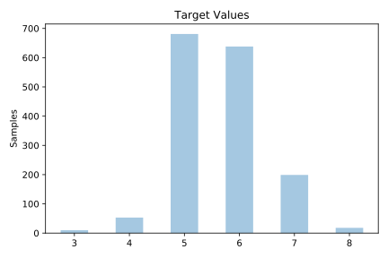
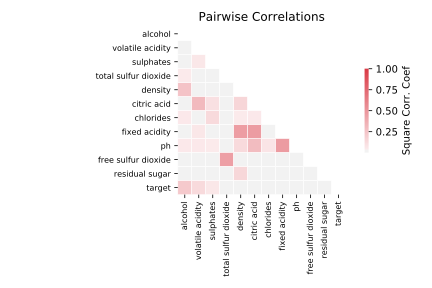

# wine_quality_red

[Metadata](metadata.yaml) | [Summary Statistics](summary_stats.csv)

## Summary

**task**: classification

**instances**: 1599

**features**: 11

**number of classes**: 11

## Summary Plots

## Data Summary

|	variable	|	count	|	mean	|	std	|	min	|	25%	|	50%	|	75%	|	max|
| --- | --- | --- | --- | --- | --- | --- | --- | --- |
|	fixed acidity	|	1599	|	8	|	1	|	4	|	7	|	7	|	9	|	15
|	volatile acidity	|	1599	|	0	|	0	|	0	|	0	|	0	|	0	|	1
|	citric acid	|	1599	|	0	|	0	|	0	|	0	|	0	|	0	|	1
|	residual sugar	|	1599	|	2	|	1	|	0	|	1	|	2	|	2	|	15
|	chlorides	|	1599	|	0	|	0	|	0	|	0	|	0	|	0	|	0
|	free sulfur dioxide	|	1599	|	15	|	10	|	1	|	7	|	14	|	21	|	72
|	total sulfur dioxide	|	1599	|	46	|	32	|	6	|	22	|	38	|	62	|	289
|	density	|	1599	|	0	|	0	|	0	|	0	|	0	|	0	|	1
|	pH	|	1599	|	3	|	0	|	2	|	3	|	3	|	3	|	4
|	sulphates	|	1599	|	0	|	0	|	0	|	0	|	0	|	0	|	2
|	alcohol	|	1599	|	10	|	1	|	8	|	9	|	10	|	11	|	14
|	target	|	1599	|	5	|	0	|	3	|	5	|	6	|	6	|	8
