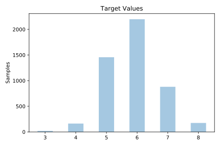
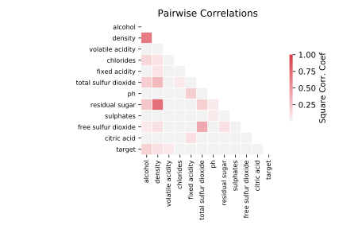

# wine_quality_white

[Metadata](metadata.yaml) | [Summary Statistics](summary_stats.csv)

## Summary

**task**: classification

**instances**: 4893

**features**: 11

**number of classes**: 11

## Summary Plots

## Data Summary

|	variable	|	count	|	mean	|	std	|	min	|	25%	|	50%	|	75%	|	max|
| --- | --- | --- | --- | --- | --- | --- | --- | --- |
|	fixed acidity	|	4893	|	6	|	0	|	3	|	6	|	6	|	7	|	14
|	volatile acidity	|	4893	|	0	|	0	|	0	|	0	|	0	|	0	|	1
|	citric acid	|	4893	|	0	|	0	|	0	|	0	|	0	|	0	|	1
|	residual sugar	|	4893	|	6	|	5	|	0	|	1	|	5	|	9	|	65
|	chlorides	|	4893	|	0	|	0	|	0	|	0	|	0	|	0	|	0
|	free sulfur dioxide	|	4893	|	35	|	17	|	2	|	23	|	34	|	46	|	289
|	total sulfur dioxide	|	4893	|	138	|	42	|	9	|	108	|	134	|	167	|	440
|	density	|	4893	|	0	|	0	|	0	|	0	|	0	|	0	|	1
|	pH	|	4893	|	3	|	0	|	2	|	3	|	3	|	3	|	3
|	sulphates	|	4893	|	0	|	0	|	0	|	0	|	0	|	0	|	1
|	alcohol	|	4893	|	10	|	1	|	8	|	9	|	10	|	11	|	14
|	target	|	4893	|	5	|	0	|	3	|	5	|	6	|	6	|	8
