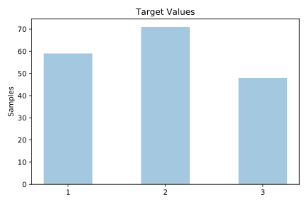
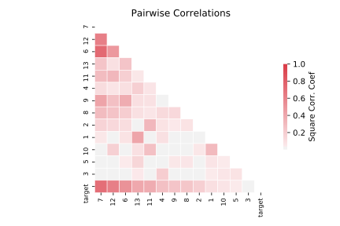

# wine_recognition

[Metadata](metadata.yaml) | [Summary Statistics](summary_stats.csv)

## Summary

**task**: classification

**instances**: 178

**features**: 13

**number of classes**: 13

## Summary Plots

## Data Summary

|	variable	|	count	|	mean	|	std	|	min	|	25%	|	50%	|	75%	|	max|
| --- | --- | --- | --- | --- | --- | --- | --- | --- |
|	target	|	178	|	1	|	0	|	1	|	1	|	2	|	3	|	3
|	1	|	178	|	13	|	0	|	11	|	12	|	13	|	13	|	14
|	2	|	178	|	2	|	1	|	0	|	1	|	1	|	3	|	5
|	3	|	178	|	2	|	0	|	1	|	2	|	2	|	2	|	3
|	4	|	178	|	19	|	3	|	10	|	17	|	19	|	21	|	30
|	5	|	178	|	99	|	14	|	70	|	88	|	98	|	107	|	162
|	6	|	178	|	2	|	0	|	0	|	1	|	2	|	2	|	3
|	7	|	178	|	2	|	0	|	0	|	1	|	2	|	2	|	5
|	8	|	178	|	0	|	0	|	0	|	0	|	0	|	0	|	0
|	9	|	178	|	1	|	0	|	0	|	1	|	1	|	1	|	3
|	10	|	178	|	5	|	2	|	1	|	3	|	4	|	6	|	13
|	11	|	178	|	0	|	0	|	0	|	0	|	0	|	1	|	1
|	12	|	178	|	2	|	0	|	1	|	1	|	2	|	3	|	4
|	13	|	178	|	746	|	314	|	278	|	500	|	673	|	985	|	1680
