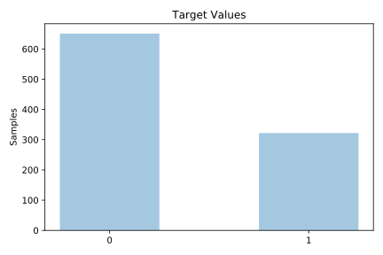
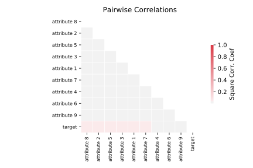

# xd6

[Metadata](metadata.yaml) | [Summary Statistics](summary_stats.csv)

## Summary

**task**: classification

**instances**: 973

**features**: 9

**number of classes**: 9

## Summary Plots

## Data Summary

|	variable	|	count	|	mean	|	std	|	min	|	25%	|	50%	|	75%	|	max|
| --- | --- | --- | --- | --- | --- | --- | --- | --- |
|	Attribute 1	|	973	|	0	|	0	|	0	|	0	|	0	|	1	|	1
|	Attribute 2	|	973	|	0	|	0	|	0	|	0	|	1	|	1	|	1
|	Attribute 3	|	973	|	0	|	0	|	0	|	0	|	1	|	1	|	1
|	Attribute 4	|	973	|	0	|	0	|	0	|	0	|	1	|	1	|	1
|	Attribute 5	|	973	|	0	|	0	|	0	|	0	|	0	|	1	|	1
|	Attribute 6	|	973	|	0	|	0	|	0	|	0	|	1	|	1	|	1
|	Attribute 7	|	973	|	0	|	0	|	0	|	0	|	1	|	1	|	1
|	Attribute 8	|	973	|	0	|	0	|	0	|	0	|	0	|	1	|	1
|	Attribute 9	|	973	|	0	|	0	|	0	|	0	|	1	|	1	|	1
|	target	|	973	|	0	|	0	|	0	|	0	|	0	|	1	|	1
