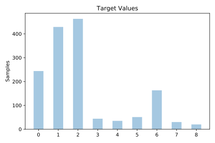
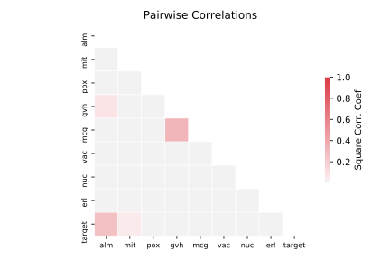

# yeast

[Metadata](metadata.yaml) | [Summary Statistics](summary_stats.csv)

## Summary

**task**: classification

**instances**: 1479

**features**: 8

**number of classes**: 8

## Summary Plots

## Data Summary

|	variable	|	count	|	mean	|	std	|	min	|	25%	|	50%	|	75%	|	max|
| --- | --- | --- | --- | --- | --- | --- | --- | --- |
|	mcg	|	1479	|	0	|	0	|	0	|	0	|	0	|	0	|	1
|	gvh	|	1479	|	0	|	0	|	0	|	0	|	0	|	0	|	1
|	alm	|	1479	|	0	|	0	|	0	|	0	|	0	|	0	|	1
|	mit	|	1479	|	0	|	0	|	0	|	0	|	0	|	0	|	1
|	erl	|	1479	|	0	|	0	|	0	|	0	|	0	|	0	|	1
|	pox	|	1479	|	0	|	0	|	0	|	0	|	0	|	0	|	0
|	vac	|	1479	|	0	|	0	|	0	|	0	|	0	|	0	|	0
|	nuc	|	1479	|	0	|	0	|	0	|	0	|	0	|	0	|	1
|	target	|	1479	|	2	|	2	|	0	|	1	|	2	|	2	|	8
